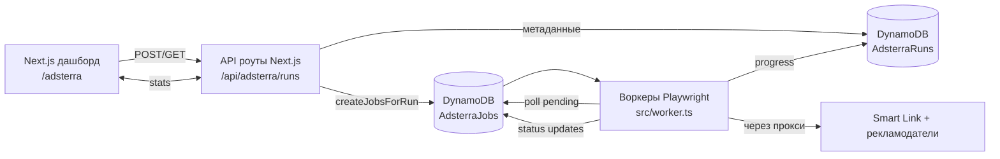

# Adsterra Smart Link Bot — обзор и схема

## Что за приложение
- Автоматизирует получение показов по Smart Link Adsterra: тысячи коротких сессий Playwright ходят по рекламной ссылке через мобильные/рез. прокси.
- Управление и мониторинг — через Next.js‑дашборд (`src/app/adsterra`), который хранит параметры запусков в DynamoDB (`AdsterraRuns`).
- Очередь задач — в DynamoDB (`AdsterraJobs`, GSI по статусу и по runId); вычисления проводятся без Redis/Worker‑pool.
- Воркеры (`npm run worker`) читают очередь, уважают расписание и динамическую конкуррентность, запускают сессии с нужными устройствами/странами/браузерами и помечают статус.

## Как всё работает
1. **Создание забега (run).** В UI задаются URL Adsterra, таргетированные показы, распределение стран/устройств/браузеров, headless/пейcинг и (опционально) целевая конкуррентность.
2. **API сохраняет мету.** `POST /api/adsterra/runs` кладёт run в `AdsterraRuns`. Запрос на старт (`/start`) ставит статус `running` и асинхронно вызывает `createJobsForRun`.
3. **Генерация заданий.** `createJobsForRun` рассчитывает pacing‑окно (fast или human), матрицу распределения и создаёт в `AdsterraJobs` задания со временем запуска и меткой runId.
4. **Пул воркеров.** Скрипт `src/worker.ts` раз в `pollInterval` берёт pending‑задачи (можно ограничить `RUN_ID`), атомарно помечает их `active`, держит семафор по динамической конкуррентности, и запускает сессию.
5. **Сессия Playwright.** `AdsterraSession` выбирает устройство/браузер по распределению, собирает прокси‑креды (BrightData по умолчанию, есть IPRoyal/DataImpulse), поднимает браузер, идёт на Smart Link, ждёт редиректы/idle, прожимает cookie/consent, ждёт на целевой странице (`MIN/MAX_AD_WAIT`), закрывает браузер.
6. **Учёт и завершение.** По итогам сессии воркер ставит job в `completed`/`failed`, считает прибыль/трафик, обновляет run‑статус на `completed`, когда для runId нет waiting/active. UI тянет свежую статистику через API (быстрый подсчёт по GSI2).

## Диаграмма

## Что важно помнить
- **Прокси и девайсы:** выбор страны/браузера делается на этапе создания/фетча job; отдельные семафоры ограничивают WebKit на Linux.
- **Пейсинг:** в режиме `human` задания распределены по окну (12–24ч или заданные часы), в `fast` исполняются сразу; воркер может игнорировать расписание через `PROCESS_IMMEDIATELY=true`.
- **Конкуррентность:** считается по активным run’ам (`calculateOptimalConcurrency`) и ограничивается `MAX_CONCURRENT_BROWSERS`; дополнительный stagger между стартами браузеров защищает прокси.
- **Надёжность:** навигация и клики ретраятся, 5xx/сетевые ошибки переводят job в retry-подобный сценарий (fail + следующая задача), run‑completion проверяется после каждой сессии и раз в 5 минут.
